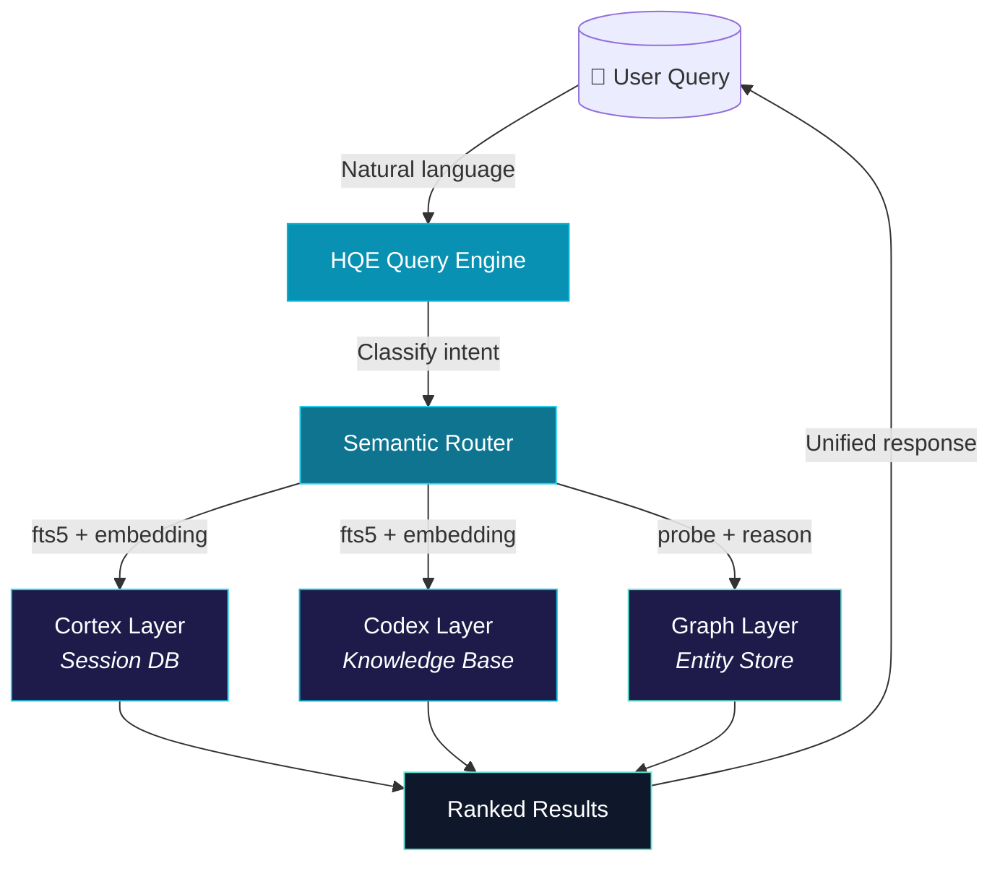

# HQE — Hermes Query Engine

<picture>
  <source media="(prefers-color-scheme: dark)" srcset="media/hqe-banner.svg">
  
</picture>

<p align="center">
  <a href="https://opensource.org/licenses/MIT"></a>
  <a href="https://www.python.org/"></a>
  <a href="#"></a>
  <a href="#"></a>
  <a href="https://github.com/kriszmac4/hqe/issues"></a>
</p>

**HQE** (Hermes Query Engine) is a unified semantic search engine for AI agent memory systems. It provides a single query interface across three distinct knowledge layers:

| Layer | Source | What it stores |
|-------|--------|----------------|
| **Cortex** | Conversation sessions | Past agent-human interactions, decisions, discussions |
| **Codex** | Knowledge base files | Structured `.md` documents, references, guides |
| **Graph** | Entity-relationship store | Facts, entities, trust scores, semantic connections |

Instead of remembering *where* something was stored, you just ask HQE *what* you're looking for — and it finds the answer across all three layers.

---

## Why HQE?

AI agents accumulate vast amounts of information across sessions, knowledge files, and structured memory stores. The problem isn't *storing* information — it's *finding* it again when you need it.

- **Cortex** knows *what was said* — but only if you remember which session
- **Codex** knows *what was written* — but requires exact file paths
- **Graph** knows *what connects to what* — but needs precise entity names

**HQE bridges all three.** One query, one result set, ranked by relevance and source quality.

## Architecture



## Features

| Feature | Description |
|---------|-------------|
| **Unified search** | One query → answers from sessions, knowledge, and entity graph |
| **Semantic routing** | Automatically classifies intent and dispatches to best source(s) |
| **Cross-layer ranking** | Results ranked by relevance, source trust, and freshness |
| **Pluggable backends** | Add new data sources via a simple adapter interface |
| **CLI-first** | Command-line interface for scripts and automation |
| **Python API** | Import as a library into any Python application |
| **Lightweight** | Zero external dependencies beyond Python stdlib + sqlite3 |

## Quick Start

```bash
# Install
pip install hqe

# Or from source
git clone https://github.com/kriszmac4/hqe.git
cd hqe
pip install -e .

# Query across all layers
hqe query "what did we decide about the deployment strategy?"

# Query a specific layer
hqe query --layer=cortex "rate limiter discussion"
hqe query --layer=codex "Natenberg delta hedging"
hqe query --layer=graph "entities related to trading bot"

# Interactive mode
hqe
```

## Configuration

```yaml
# ~/.config/hqe/config.yaml
hqe:
  cortex:
    db_path: "~/.hermes/profiles/*/state.db"
  codex:
    paths:
      - "~/knowledge-base/**/*.md"
      - "~/repos/*/knowledge/**/*.md"
  graph:
    db_path: "~/.hermes/facts/*.db"
  ranking:
    max_results: 20
    min_score: 0.3
```

## Use Cases

- **"Where did we talk about the Wheel strategy?"** → Cortex finds the session
- **"What does Chan say about risk management?"** → Codex finds the document
- **"Which projects use SQLite?"** → Graph finds entity relationships
- **"Show me everything about deployment"** → All three layers, unified

## Project Structure

```
hqe/
├── hqe/                    # Python package
│   ├── __init__.py
│   ├── cli.py              # Click/argparse CLI
│   ├── engine.py           # Core query engine
│   ├── router.py           # Semantic intent router
│   ├── layers/
│   │   ├── cortex.py       # Session DB adapter
│   │   ├── codex.py        # Knowledge base adapter
│   │   └── graph.py        # Entity graph adapter
│   └── ranking.py          # Cross-source result ranking
├── media/
│   └── hqe-banner.svg      # Project banner
├── tests/
├── config.example.yaml
├── setup.sh
├── LICENSE
├── .gitignore
├── pyproject.toml           # Or setup.py
└── README.md
```

## Roadmap

- [x] Architecture design & concept
- [ ] Core query engine with router
- [ ] Cortex adapter (SQLite FTS5)
- [ ] Codex adapter (directory + embedding)
- [ ] Graph adapter (entity store probe/reason)
- [ ] CLI interface
- [ ] Python API
- [ ] Cross-layer ranking
- [ ] Plugin system for custom sources

## Contributing

Contributions are welcome! See [CONTRIBUTING.md](CONTRIBUTING.md) (coming soon) for guidelines.

## License

MIT License — see [LICENSE](LICENSE) for details.

---

<p align="center">
  <sub>Built for the Hermes ecosystem · Query smarter, not harder.</sub>
</p>
